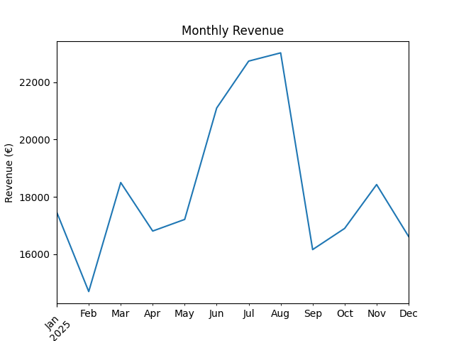
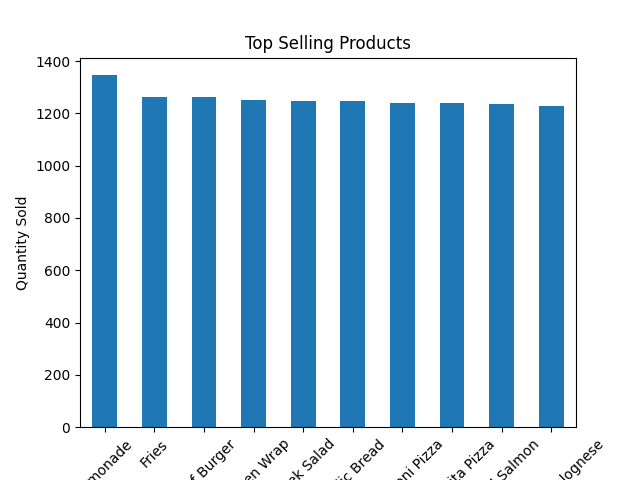
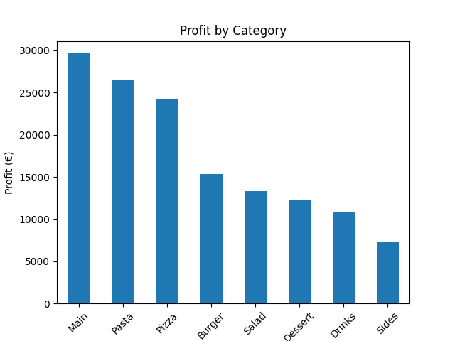

# Restaurant Business Analysis

## Project Overview

In this project, I analyze restaurant sales data to understand how the business performs over time, what customers are ordering, and which products generate the most profit.

The goal is to approach this like a real data analyst: explore the data, identify patterns, and provide insights that could help improve business decisions.

---

## Dataset

The dataset includes:

* Orders data
* Order item details (products sold per order)
* Menu information (prices and estimated costs)
* Customer data

The data covers a full year (2025) and contains over 7,000 orders, allowing for realistic analysis of trends and behavior.

---

## Tools Used

* SQL (SQLite / DBeaver)
* Python (pandas, matplotlib)
* GitHub for version control

---

## Key Findings

### Monthly Revenue Trends

Revenue shows some clear patterns over time. There is a noticeable drop in February, likely due to seasonal slowdown, followed by a strong recovery in March.

Revenue continues to grow in the following months and reaches its peak in June, suggesting increased demand during the summer period. Overall, the trend indicates gradual business growth.

---

### Top-Selling Products

The analysis shows that Lemonade is the most sold product, highlighting strong demand for beverages. Fries also rank very high, confirming that side items play an important role in increasing order value.

Chicken Wrap stands out as the most popular main dish. Overall, sales are distributed across drinks, sides, and mains, which suggests strong cross-selling behavior.

---

### Profitability Analysis

While some items sell more than others, profit tells a more important story.

Main dishes generate the highest profit, followed by Pasta and Pizza categories. On the other hand, drinks and sides, although popular, contribute less to total profit.

This shows that focusing on high-margin products is more impactful than simply increasing sales volume.

---

### Peak Hours Analysis

Customer activity is clearly concentrated in the evening. The highest number of orders occurs between 18:00 and 21:00, with 19:00 being the busiest hour.

Lunch hours are noticeably weaker, which suggests an opportunity for promotions or targeted offers.

This insight is especially useful for staffing and operational planning.

---

## Business Recommendations

Based on the analysis, a few practical recommendations can be made:

* Focus on promoting high-margin items such as main dishes, pasta, and pizza
* Create combo deals (main + drink + side) to increase average order value
* Allocate more staff during peak dinner hours to improve service speed
* Introduce lunch promotions to increase midday sales
* Consider small price adjustments for drinks and sides to improve margins

---

## Visualizations

### Monthly Revenue

### Top Selling Products

### Profit by Category

---

## Project Structure

restaurant-business-analysis/
│── data/
│── sql/
│── notebooks/
│── images/
│── README.md

---

## Conclusion

This project shows how data analysis can be used to better understand business performance and support decision-making.

By combining SQL, Python, and business thinking, it is possible to move from raw data to actionable insights that can improve both revenue and profitability.

---

## Author

Christos Patitis
Aspiring Data Analyst

